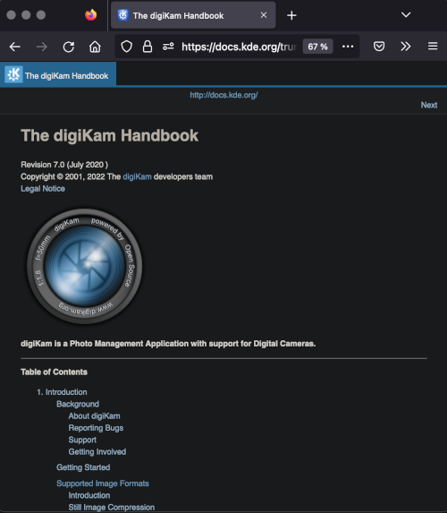
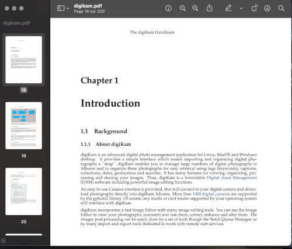

This repository host digiKam handbook based on [DocBook](https://en.wikipedia.org/wiki/DocBook) format.

This documentation is weekly generated and [published here as HTML and PDF](https://docs.kde.org/index.php?language=en&package=digikam-doc).

[](project/images/digiKam_handbook_HTML.png)|[](project/images/digiKam_handbook_PDF.png)|

# Dependencies

To compile the documentation, install the following development packages:

* [CMake](https://www.cmake.org) >=3.16.0
* [ECM](https://invent.kde.org/frameworks/extra-cmake-modules) >= 5.55.0
* [KF5::I18n](https://invent.kde.org/frameworks/ki18n) >= 5.55.0
* [KF5::DocTools](https://invent.kde.org/frameworks/kdoctools) >= 5.55.0
* [GetText](https://www.gnu.org/software/gettext) >= 0.20.0

# Compilation

If you checkout this git repository, DocBook files can be compiled under Linux from a console using these steps:

```
# bootstrap.sh
# cd build
# make
```

To install the documentions on your system:

```
# make install/fast
```

To uninstall the documentations from your system:

```
# make uninstall
```

# Continuous Integration

At all changes in this repository as commits and Merge Request, the Continuous Integration will recompile
automatically all the contents to check the validity of the DocNook files, including the current translations
of the documentations.

See the [CI/CD section](https://invent.kde.org/documentation/digikam-doc/-/pipelines) for details.

# File Structures

The substructure of the help files that develop as a tree are created by <chapter> tags.

Respect the file naming convension ordred by chapter name, main section, and title resume, separated by minus.

The digiKam DocBook files are shared with the Showfoto handbook.

# How to make a screenshot for the manual with Alpha Blending 3D Border

- Never use advanced color theme to make screenshots. Always use desktop default color and icon set.

- Use Festival Import to take a shot. Use region selection option to select only
  important area. Remove buttons and dialog header to limit image file size.
  _ALWAYS use PNG file format to save image to prevent compression artifacts.

- Use script project/screenshot-dropshadow.sh to add border frame around the shot.
This script requires ImageMagick command line tools installed on the system.

The script can be run on a single file or in batch mode. To run in batch
mode, call it like this from within the images folder:

$> screenshot-dropshadow.sh -b png

where <png> is the file extenion to look for. The script can be used
with additional arguments, see '-h' for more options.

# PNG screenshot optimizations

Since the documentation is very good it is also very demanding in terms of volume, 99% whereof are screenshots.

In order to limit the byte count to the minimum the following command chain shall be used to reduce the png file size.

A factor of 2-4 can be gained. From within the folder where the png reside, use script project/optpng.sh.
This script requires pngnq and optipng command line tools installed on the system.

To process all png files in one step : find *.png | xargs -0 ./makess.sh

# Links

- [Converting handbook in PDF or Epub](https://userbase.kde.org/How_To_Convert_a_UserBase_Manual_to_Docbook#Converting_into_PDF)
- [Get Involved in the KDE Documentation workflow](https://community.kde.org/Get_Involved/documentation)

# Credits

[digiKam team](http://www.digikam.org)

